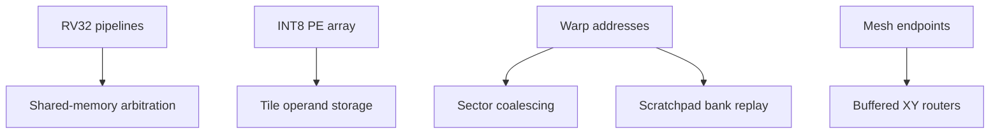

# Four studies, one architectural theme

Execution performance depends on both arithmetic and moving data to the right place at the right time. This collection studies four boundaries separately so each can be tested and explained without a proprietary toolchain.

This diagram describes the implemented studies. It does **not** imply that all four have been integrated into one SoC. Each top level has its own test environment and interface contract. A future integrated system would need address maps, adapters, reset sequencing, a software runtime, and an end-to-end memory model.

## Why these boundaries matter

| Study | Observable mechanism | Design skill demonstrated | Principal simplification |
| --- | --- | --- | --- |
| CPU cluster | Forwarding, dependency stalls, redirects, precise terminal traps, round-robin service | Pipeline control and architectural verification | No caches, atomics, interrupts, or operating system |
| Systolic tile | Skewed operand injection, nearest-neighbor movement, stationary accumulation | Dataflow scheduling and utilization analysis | One resident tile; loading and computing do not overlap |
| Warp memory | Unique-sector grouping, tagged out-of-order completion, bank replay and broadcast | Memory parallelism and access-pattern reasoning | One resident warp; modeled memory service |
| Mesh | Input queues, XY routes, locked output grants, contention | On-chip interconnect design and packet scoreboarding | Single-flit packets; no virtual channels |

## Common engineering contracts

All designs use one clock and an active-high synchronous reset. A transfer occurs only at a rising edge where both valid and ready are high. Producers retain payload while stalled. Reset clears control state and invalidates outstanding work. Storage contents that are not explicitly initialized must be written before being read.

Parameter sweeps are evidence only for the listed combinations. Passing a 3×3 NoC experiment does not establish correct elaboration for every mesh size. Port widths and parameter restrictions are specified in each guide.

The same separation is maintained throughout the documentation:

1. **Implementation:** what the RTL actually contains.
2. **Verification:** stimuli and properties actually checked.
3. **Measurement:** counters or logs emitted by simulation.
4. **Inference:** architectural interpretation of those measurements.
5. **Extension:** work that remains to be implemented and verified.
