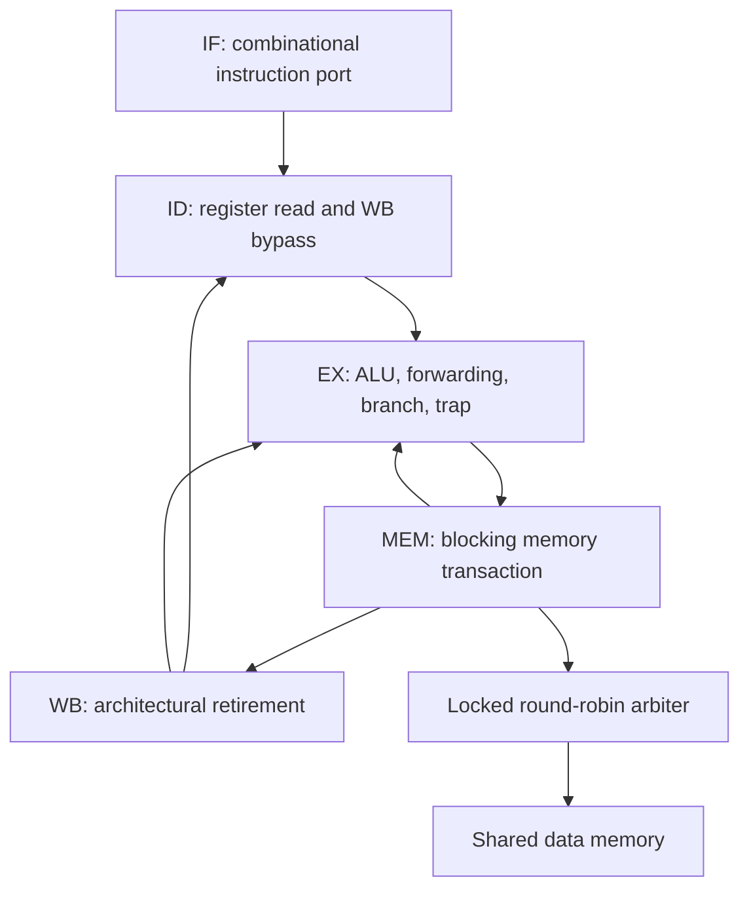

# RV32 cluster architecture

## Pipeline and ownership

Four copies of the pipeline use private instruction ports and one shared data port. The testbench supplies a common program image. There is no instruction cache or instruction-port wait signal: `imem_rdata` must correspond combinationally to `imem_addr` before the capture edge.

Stages have explicit valid bits. A valid bit determines whether a stage represents an instruction; stale payload in an invalid stage has no architectural effect. Reset empties all stages, sets PC to zero, clears the integer register file, and sets a0/x10 to `HART_ID`.

## Data interface

| Signal | Direction at core | Contract |
| --- | --- | --- |
| `mem_valid` | Out | A load or store is waiting to complete |
| `mem_addr[31:0]` | Out | Four-byte-aligned byte address; stable while waiting |
| `mem_wdata[31:0]` | Out | Store bytes shifted to the addressed little-endian lanes |
| `mem_wstrb[3:0]` | Out | Byte write enables; zero denotes a read |
| `mem_ready` | In | Completes the transaction on this rising edge |
| `mem_rdata[31:0]` | In | Full read word, valid on the completion edge |

This is a **completion handshake**, not AXI and not a separate request/response interface. Memory must apply a write once on `valid && ready`, and return load data on that same edge. There is at most one waiting transaction per hart. There is no bus-error input; address validity is a system-level contract.

At the cluster boundary, the arbiter searches from `rr` for a requester. If memory is not ready, it records the owner and holds that grant. Other harts cannot displace the transaction. On completion, the next search starts after the serviced hart. If requesters remain asserted and memory completes transactions, each receives service; this is not a cycle bound without a bound on memory latency.

## Dependency handling

The EX operand selects EX/MEM forwarding before MEM/WB forwarding. EX/MEM cannot forward an unfinished load. Decode also bypasses a WB write occurring on its register-read edge. x0 never forwards a value and never accepts a write.

If a load in EX produces a register used by the instruction in ID, the controller holds IF/ID and injects one EX bubble. When the load reaches MEM, the entire front of the pipeline waits until memory completes. After completion, the dependent instruction can obtain the load value from WB.

During a MEM stall, WB drains rather than repeatedly retiring its old instruction. A subtle consequence is that an EX operand may initially be supplied by WB and lose that source on the following stalled clock. The `blocked` path therefore captures the forwarded operand into the held EX operand register. This keeps the architectural value available for any length of memory wait.

## Control flow and terminal traps

Branches and jumps resolve in EX. A redirect invalidates the younger ID instruction and prevents it from entering EX; fetch restarts at the target. The design does not predict branches.

| Terminal condition | Reported cause | Architectural effect |
| --- | --- | --- |
| Taken control transfer to a non-four-byte-aligned target | 0 | No link write or redirect |
| Unsupported/illegal instruction encoding | 2 | No register or memory side effect |
| EBREAK | 3 | Terminal halt after older instructions drain |
| Misaligned load | 4 | No memory request |
| Misaligned store | 6 | No memory request |
| ECALL | 11 | Project terminal convention using the M-mode environment-call cause number |

The implementation has no privilege-mode state. Cause values are trace metadata; a terminal trap does not enter an architectural privileged handler. FENCE with the supported base encoding is a no-op because each hart's memory operations complete in order through the blocking interface. FENCE.I and CSR instructions are unsupported.

On a trap, fetch stops and younger work is invalidated. Older work drains. The trap is exposed at WB and sets `halted`. Its trace event is included in differential checking, but `retired` excludes the faulting instruction.

## Trace and counters

`trace_valid` identifies a WB event. PC and instruction are always meaningful for that event. `trace_rd` is zero when no architectural register write occurs; `trace_value` is meaningful only for a nonzero trace destination. Trap and cause accompany terminal events. Stores are checked through their effects on final RAM, rather than through a separate memory-retirement trace.

`cycles`, `retired`, `memory_stalls`, `load_stalls`, and `redirects` are 32-bit wrapping counters. Memory stall clocks include time waiting behind other cores and time waiting for external memory. They do not separate arbitration from memory service.

## Design decisions

| Choice | Benefit | Cost / next design question |
| --- | --- | --- |
| Resolve branches in EX | Simple operand reuse and control | Flush latency and no prediction |
| Block at MEM | Straightforward in-order completion | Miss latency stalls unrelated work |
| Shared serialized memory | Simple visibility with no caches | Bandwidth bottleneck as core count rises |
| Private data regions in tests | Independent architectural oracle per hart | Does not validate shared-memory synchronization software |
| Terminal traps | Inspectable precise stopping behavior | Not sufficient for an OS or architectural certification |

Source reference: [RISC-V RV32I Base Integer Instruction Set v2.1](https://docs.riscv.org/reference/isa/v20260120/unpriv/rv32.html). Encoding implementation is original. The project does not claim compliance certification from using the specification.
