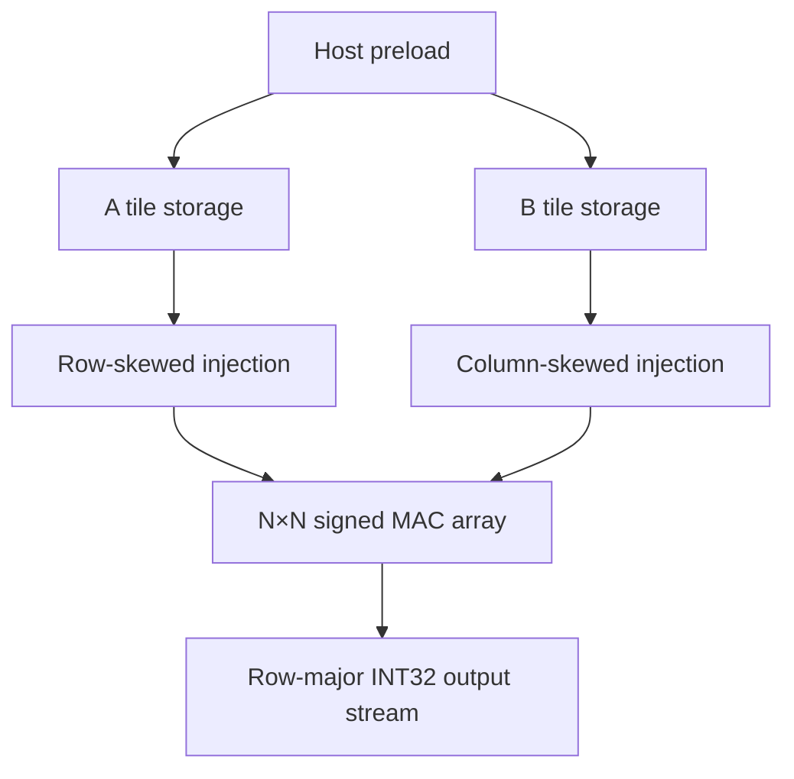
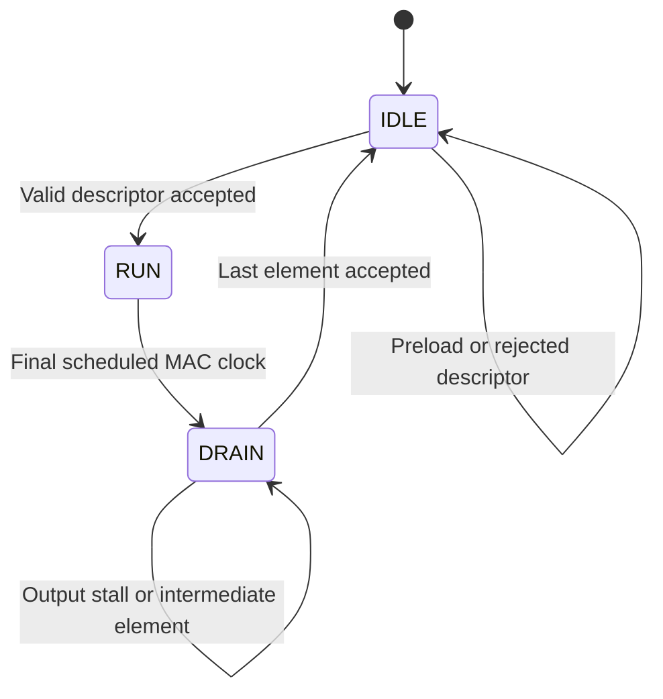

# Systolic tile architecture

## Datapath

At each RUN clock, a PE multiplies its current signed 8-bit inputs, sign-extends the 16-bit product, adds it to its 32-bit accumulator, and registers both operands for its neighbors. Accumulation wraps modulo 2³². There is no saturation or requantization. For the tested K≤16, the full signed INT8 product sum cannot overflow INT32, so overflow wrapping is an RTL arithmetic contract rather than an exercised boundary in this suite.

## Operand placement and schedule

A storage uses index `row*K_MAX + k`; B storage uses index `k*N + column`. Both have N×K_MAX bytes. `K_MAX` defaults to 16. The host can preload arbitrary bytes while idle. Memories are not reset; initialize every operand that the next descriptor will read.

At RUN tick t, the left edge of row r injects `A[r,t-r]` if the index is in `[0,K)` and r is active. Otherwise it injects zero. The top edge of column c similarly injects `B[t-c,c]`. Both operands for product k meet at PE(r,c) at `t=k+r+c`.

The final useful product reaches the bottom-right physical PE at `K-1+2(N-1)`. Counting RUN ticks from zero gives:

`compute_cycles = K + 2N - 2`

The controller retains this physical-array schedule for masked tiles. Inactive rows or columns inject zero, and their output elements are zero. It does not optimize away empty physical edges.

For N=4, K=16, full activation: 256 useful MACs / (16 physical PEs × 22 clocks) = **72.73% compute utilization**. A MAC means one multiplication plus accumulation; no frequency is assumed. End-to-end throughput additionally pays host preload and N² result transfers.

## Interface contract

| Interface | Fields | Transfer behavior |
| --- | --- | --- |
| Configuration | `cfg_valid/ready`, `cfg_is_b`, `cfg_index`, `cfg_data` | Writes one byte; accepted only while IDLE with an in-range index |
| Start | `start_valid/ready`, K, active rows, active columns | Captures descriptor and clears PE accumulators |
| Result | `out_valid/ready`, `out_index`, signed `out_data`, `out_last` | N² row-major elements, including zeros for masked positions |
| Status | `done`, `error` | One-clock pulses for accepted final result or rejected descriptor |

`start_ready` is low whenever configuration valid is asserted, even if that configuration index is invalid. Host software must not hold an invalid configuration request forever while expecting a start to be accepted.

A start descriptor is valid when `1≤K≤K_MAX`, `1≤rows≤N`, and `1≤cols≤N`. An invalid descriptor is accepted as a command but emits `error` and remains idle. It does not clear accumulators or generate output. While computing or draining, configuration and start are blocked.

## Controller

The accumulator is updated on the edge that ends RUN. DRAIN reads the updated value afterward. `out_index`, data, and last remain stable while the consumer is not ready. The next tile cannot start until the current result stream is fully accepted.

## Counters and tradeoffs

`compute_cycles` counts RUN clocks. `output_stalls` counts DRAIN clocks with ready low. `useful_macs=rows*cols*K` describes mathematically active operations, not toggling activity or measured power. All counters are 32-bit.

Nearest-neighbor forwarding avoids a global broadcast network inside the array. Output-stationary accumulation avoids moving partial sums each clock. The tradeoff is a skew controller, fill/drain cost, register-based operand storage, and serialized output. The current preload interface writes only one byte per accepted clock and does not overlap computation; this is a major system-level bottleneck that peak MAC counts do not capture.
