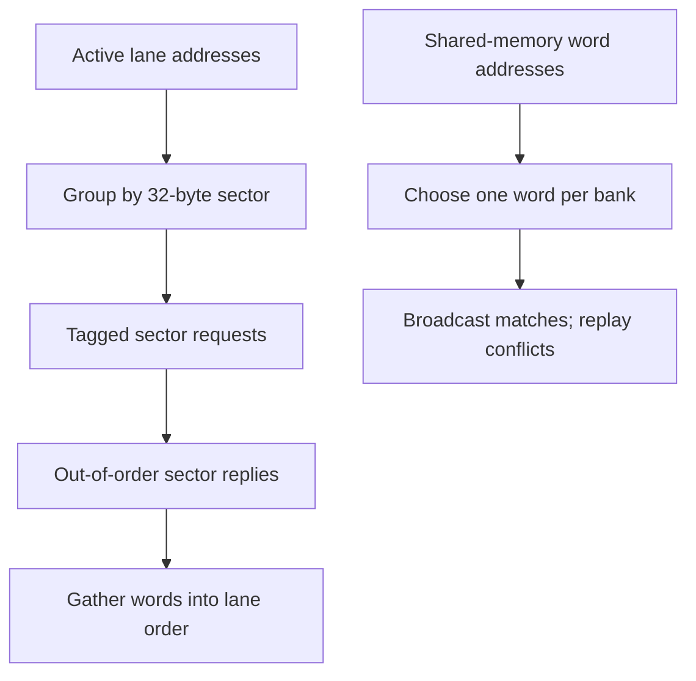

# Warp memory architecture

## Two separate top levels

The global and shared-memory paths are independent modules with different address units. They are not connected to a processor in this collection. This separation makes transaction grouping and bank scheduling observable without a full SIMT front end.

## Global-load coalescer

`LANES` defaults to 32; 8 and 32 are tested. The input has a 32-bit warp tag, active-lane mask, and one 32-bit **byte address** per lane. Active addresses must be naturally aligned 32-bit words. All inactive outputs are zero.

The coalescer captures one warp. A pending mask tracks lanes whose sector has not been requested. It selects the lowest pending lane, aligns that address down to 32 bytes, and presents a sector request. On acceptance, every pending lane in the same sector records that request tag and leaves the pending set.

The request tag is the leader lane index, carried in a 32-bit port. A leader is removed from the pending set when issued, so its tag cannot be reissued for that warp. A bitmap tracks outstanding tags. Up to LANES unique sectors can be outstanding; the actual occupancy depends on request readiness and response latency.

| Port group | Contract |
| --- | --- |
| `warp_valid/ready` | Capture warp tag, lane mask, and all lane addresses on handshake |
| `req_valid/ready`, `req_addr`, `req_tag` | Stable request for one aligned 32-byte sector; tag unique within the resident warp |
| `rsp_valid/ready`, `rsp_tag`, `rsp_data[255:0]` | Reply for a previously accepted request; eight little-endian 32-bit words |
| `out_valid/ready`, tag, lane data, error | One completed warp, retained until accepted |

Responses may return in any order. Each active lane reads the word selected by its saved address bits `[4:2]` from its tagged reply. A response must refer to a request accepted on an earlier edge; zero-latency same-edge acceptance/response is not supported. The producer must hold a reply stable until accepted. Invalid or duplicate response tags are not acknowledged. They are a memory-protocol violation, not a recoverable architectural exception in this implementation.

After pending and outstanding masks are empty, the completed warp becomes visible. There is one final ACTIVE clock for completion detection. `latency_cycles` counts ACTIVE clocks and excludes output stalls. `sectors` increments on accepted sector requests, and `active_lanes` is captured from the input mask.

An empty mask produces a zero-data completion with no requests. If any active address is misaligned, the whole warp completes with `out_error=1`, zero data, and no requests. Inactive misaligned addresses are ignored. Reset discards the current context; the external memory environment must discard pre-reset responses too.

### Worked sector counts

For 32 active lanes reading 32-bit words:

| Byte address of lane i | Unique 32-byte sectors | Explanation |
| --- | --- | --- |
| `4*i` | 4 | Eight words per aligned sector |
| `4+4*i` | 5 | The range crosses an extra sector boundary |
| `32*i` | 32 | Every lane selects a different sector |
| `0` | 1 | All lanes gather the same word |

These are transaction counts, not cache misses or DRAM bursts. The test memory returns a deterministic data function with randomized latency; it contains no cache model.

## Banked scratchpad

The scratchpad accepts a warp-sized load or store with a lane mask, per-lane **word addresses**, and per-lane store values. `WORDS=256` and `BANKS=8` by default. Supported experiment parameters use power-of-two bank counts that divide WORDS evenly.

`bank = word_address % BANKS`, `row = word_address / BANKS`.

Each physical bank owns its own storage array and one write port. On each SERVICE clock, the scheduler chooses the lowest pending lane in each bank. All lanes addressing that same word are served together. Distinct words in the same bank remain pending and replay on later clocks.

For loads, the selected word broadcasts to all matching lanes. For stores, the highest active lane among same-word matches supplies the single bank write value. That deterministic collision rule is an explicit project contract. It does not claim that unsynchronized CUDA stores have an equivalent guarantee.

| Port group | Contract |
| --- | --- |
| `in_valid/ready`, `is_store`, mask, word addresses, store data | Capture one operation while idle |
| `out_valid/ready`, `load_data`, error | One completion for either load or store; store response data is zero |
| `service_cycles` | Number of distinct-word service rounds, excluding input and output wait |

For a valid operation, the expected service time is:

`max over banks(number of distinct active word addresses in that bank)`.

An empty mask completes without service. Any active out-of-range address rejects the entire operation with zero data and no writes. Memory contents are not reset. Software must initialize words before loading them. Reset clears control and cancels a pending completion; writes already performed before reset are not rolled back.

## Engineering tradeoffs

| Decision | Benefit | Limitation |
| --- | --- | --- |
| One resident warp | Simple lifetime and response ownership | No latency hiding across warps |
| Leader lane used as tag | No separate free-list allocator | Tag namespace tied to lane count |
| Multiple sector requests in flight | Overlaps modeled memory latency | No capacity beyond one warp |
| Explicit physical banks | One write port per bank, inspectable synthesis | Combinational lane selection grows with lane/bank count |
| Replay conflicts | Correct finite service for any valid access pattern | One operation blocks later operations |

Primary references: [NVIDIA CUDA kernel execution and memory model](https://docs.nvidia.com/cuda/cuda-programming-guide/02-basics/writing-cuda-kernels.html) and [CUDA C++ Best Practices Guide](https://docs.nvidia.com/cuda/cuda-c-best-practices-guide/index.html). The projects use those public concepts as motivation; their interfaces, bank count, scheduling, and error behavior are original simplified contracts.
