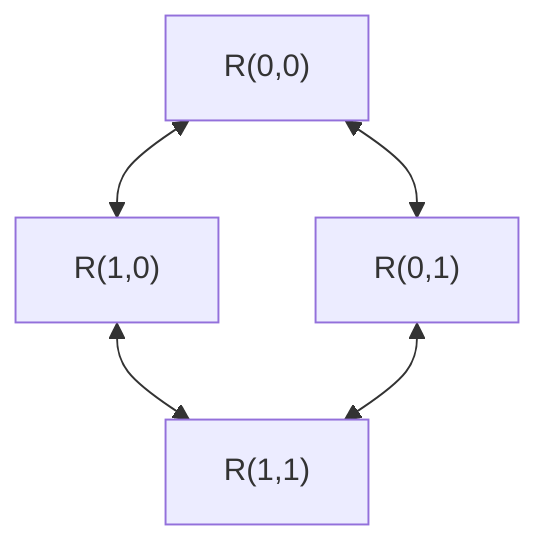

# Mesh NoC architecture

## Topology and flit

The top level exposes one injection and one ejection ready/valid port per node. A node is numbered `y*NX+x`, starting at the upper-left corner. X increases to the east and Y to the south. Links do not wrap.

Each router also has a local endpoint connection, omitted here to keep the mesh links visible. Both directions of a neighbor link are independent ready/valid channels.

| Flit bits | Field | Use |
| --- | --- | --- |
| `[7:0]` | Destination X | Routing |
| `[15:8]` | Destination Y | Routing |
| `[23:16]` | Source ID | Testbench identity; router treats as payload |
| `[39:24]` | Source-local sequence | Scoreboard identity; router treats as payload |
| `[63:40]` | Payload | End-to-end integrity check |

The router is agnostic to all bits above the destination. This is a project packet format, not a standard interconnect protocol. The source must provide coordinates inside the configured mesh. An out-of-range destination can stall at a boundary indefinitely; there is no packet-drop or error-response mechanism.

## Input buffers

Each router contains five independent `rv_fifo` instances for local, north, east, south, and west inputs. Default depth is four flits. Output data is the current FIFO head; valid depends on occupancy. A read occurs only when a granted output transfers that head.

The FIFO accepts a simultaneous push and pop when not already full. At full occupancy, `in_ready` stays low even if a pop occurs that edge; the newly freed slot is available on the next clock. This deliberate one-clock recovery behavior removes combinational ready propagation through the queue. It can reduce throughput for shallow queues under pressure and is part of the measured implementation.

Data memory is not reset because an empty queue makes its contents invalid. Read/write pointers and occupancy reset to zero.

## Routing and arbitration

The route function examines each input's head:

1. If destination X differs, route east or west.
2. Otherwise, if destination Y differs, route north or south.
3. Otherwise, eject locally.

Each output independently searches eligible input heads in round-robin order. If the output cannot transfer, its input owner is locked. This prevents changing the packet while valid is asserted and ready is low. After a successful transfer, the next arbitration search starts after the winning input.

An input head has exactly one route, so it cannot legitimately be granted to multiple outputs. The implementation provides no bypass path around its input FIFO. A blocked head can prevent packets behind it from using otherwise idle outputs: classic head-of-line blocking.

## Progress assumptions

X-before-Y routing on a non-wrapping mesh avoids cyclic channel dependencies under the ordinary dimension-order routing argument. This is architectural reasoning, not a formal proof produced by this repository. System progress also requires sinks to accept traffic and sources to use legal destinations. A stalled endpoint can back up queues even when the routing algorithm is well behaved.

Round-robin arbitration prevents indefinite exclusion among continuously eligible inputs when the output keeps completing transfers. It does not give a fixed end-to-end latency bound if traffic or sink stalls are unbounded.

The testbench guarantees each sink is ready at least once every eight testbench cycles. It injects a finite number of packets, then lets the mesh drain. Passing those experiments demonstrates progress under those explicit conditions.

## Metrics

Injection time is recorded on the edge where the network accepts a packet, and ejection time on the edge where the endpoint accepts it. Latency is their difference. Time spent waiting at the source before accepted injection is excluded.

`accepted_packets_per_node_cycle = delivered_packets / (node_count × total_workload_cycles)`.

This average includes injection and drain for a finite workload. It is not a steady-state saturation throughput estimate. The `RATE` parameter is a source offer probability when a source can offer another packet, not a guaranteed injection rate. At RATE=100 the reference experiment also lowers random sink readiness, so comparisons across rates change two conditions; use the full table before attributing causality.

## Parameter and implementation boundaries

The tested meshes are 2×2, 3×2, and 3×3, with FIFO depths 2 or 4. Destination coordinates are eight-bit fields. Wider meshes, depth=1, malformed destinations, and asynchronous clocks are outside the checked parameter set. Every port shares one synchronous clock/reset domain.

The router has no virtual channels. A multi-flit extension would need persistent packet ownership from header through tail; the current lock lasts only until one stalled flit transfers. Adding a packet length field alone would not create wormhole routing.
